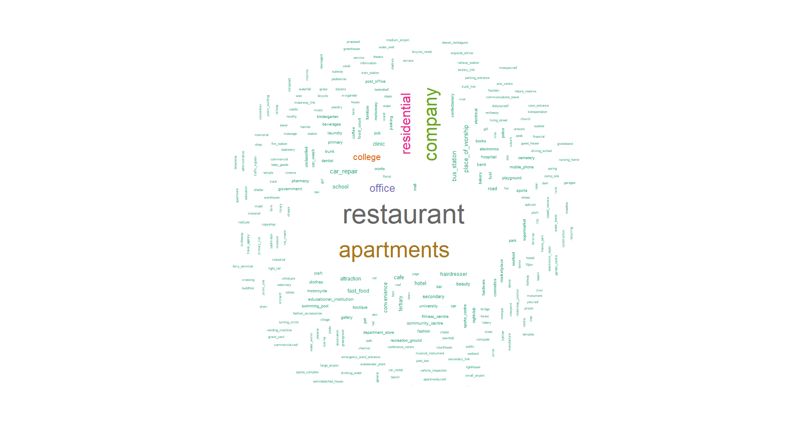

```{r include=FALSE}
library(knitr)
library(ggplot2)
```

# Place of Interest Labeling Documentation

## 1.0 Objective (Problem Statement)

The objective of this task is to label any place of interest (POI) name into Open Street Map (OSM) categories. For an example, if the POI name is something related to a restaurant, the POI will be categorized as in OSM category which is "amenity restaurant".

## 2.0 Scope of Work

### 2.1 Steps to complete the task:

1. Plot a few wordcloud to see if there is any pattern in the categories.
2. Data cleaning of the POI names and categories.
3. Building POI word frequency dictionaries in each categories.
4. Validating POI NLP Naive Bayes word frequency dictionaries for each categories.
5. Build stacked machine learning model for POI category prediction
5. Validate and analyze the machine learning model for it to be fully utilized.

### 2.2 Plotting wordclouds

Plotting wordclouds is useful to visualize what is the most frequent words appear in the data. The wordclouds were plotted to see if the most frequent word in the POI category relates to the name of the POI category.

**The most frequent sub-category in the POI data:**


**The most frequent word for all of the words in the POI name:**


**The most frequent word in "amenity restaurant" category:**


**The most frequent word in "building apartments" category:**


**The most frequent word in "route road" category:**


As you can see, the most frequent word in "building apartments" and "route road" categories is the word "jalan". So in order to build a POI category prediction model, Naive Bayes classifier concept is used in the model. This is because the prediction requires probabilistic classifiers in order to solve the problem.

### 2.3 Data cleaning of the POI names and categories

#### Steps of POI data cleaning

1. Remove non-ASCII characters in the POI name.
2. Convert the POI name characters to lower case letters.
3. Remove numbers in the POI name.
4. Remove punctuation in the POI name.
5. Remove stopwords in the POI name.
6. Convert the POI name to it's stemming.
7. Remove white space in the POI name.
8. Remove empty or Null data in the POI name and POI categories.
9. Remove the categories that do not match the keys and values in OSM categories.

The result of the data cleaning is number of rows of POI data dropped from 701684 to 554609. The number of categories in the POI data dropped from 334 to 265. The number of rows of POI data is sufficient for training an NLP model for POI category prediction.

### 2.4 Building POI word frequency dictionary in each categories

When building the word frequency dictionary of each category, the data of that current category and it's non of it's category is taken. For an example, if I am building the word frequency dictionary for "amenity restaurant", I also need to take the data of any category but not from "amenity restaurant" in order to differentiate the "amenity restaurant" category from others. The data of non of it's category is taken 2-3 times the number of rows of it's category. Let say I am taking 10,000 rows of data from "amenity restaurant" category, the category besides it will be around 20,000-30,000. This is because the word frequency dictionary needs to differentiate what is the word that needs more focus on in that category.

#### The table below is an example of word frequency dictionary for "amenity restaurant" category

**The highest frequency of word in "amenity restaurant":**
```{r echo=FALSE}
dict = readRDS("nlp_model/nlp_1.RDS")
kable(head(dict$lambda,5), format = "markdown")
```

**The lowest frequency of word in "amenity restaurant":**
```{r echo=FALSE}
decrease = dict$lambda[order(dict$lambda$pos_freq),]
kable(head(decrease,5), format = "markdown")
```

**pos_freq** = The frequency of the word that appear in "amenity restaurant" category

**neg_freq** = The frequency of the word that appear in **besides** "amenity restaurant" category

**pos_prob** = The probability of the word appeared given that they are in "amenity restaurant" category

**neg_prob** = The probability of the word appeared given that they are **not** in "amenity restaurant" category

**lambda** = The **log of (pos_prob/neg_prob)** or also known as the loglikelihood

**Note:** The probability of **pos_prob and neg_prob uses laplacian smoothing** in order to avoid getting error when the word frequency is zero.

Lambda is very important when calculating the score of the POI name. This is because when the word in the POI name is less likely to be appear in that category, it will return a negative value. Also for the word is more likely to appear in that category, it will return as positive value.You can see in the tables above. The word "restoran" have a value of 3.947083 for lambda while the word "pangsa" have a value of -6.715105.

To predict the POI name is in which category, the score will be calculated using the value of lambda and logprior.

The **logprior** is the **log (the number of rows of the dataset of the training category/the number of rows of the dataset of not of the training category)**. The logprior for "amenity restaurant" is -0.9162907.

The formula of the score when predicting the category = the total value of lambda + logprior

For an example the POI name of "koay teow soup".
```{r echo=FALSE}
kts = decrease[grepl("koay|teow|soup",decrease$word),]
kable(kts,format = "markdown")
```

According to the table above, the score will be:

Score = 5.536275 + 5.905808 + 7.606854 - 0.9162907(logprior) = 18.132646

"koay teow soup" will be in "amenity restaurant" category as the predicted score is above zero.

**Note:** If the word is not in the word frequency dictionary, the value of lambda will be zero.

### 2.5 Validating the word frequency dictionary accuracy

The total number of word frequency dictionary for each category is 209 built from 265 OSM categories in the POI Data. There are 56 categories left not be built their word frequency dictionary. This is because the data provided for each of that categories are less than 10 rows.The categories are discarded as it does not have much data to be trained.

#### The table below is the example of testing the accuracy of word frequency dictionary in each category

**Highest accuracy of category prediction:**
```{r echo=FALSE}
nb_accuracy = readRDS("data/naivebayes_accuracy.RDS")
nb_accuracy = nb_accuracy[order(nb_accuracy$accuracy,decreasing = T),]
kable(head(nb_accuracy,5), format = "markdown")
```

**Lowest accuracy of category prediction:**
```{r echo=FALSE}
nb_accuracy = nb_accuracy[order(nb_accuracy$accuracy,decreasing = F),]
kable(head(nb_accuracy,5), format = "markdown")
```

### 2.6 Building and validate stacked machine learning model

The stacked machine learning is the concept of using multiple machine learning model in a dataset. This concept is used because the categories that needs to be predicted is 209 categories which is difficult for a single machine learning model predict all of the categories as the output of most categorical machine learning model is only True or False which is binary. So how stacked machine learning is applied here? The answer is by comparing the score of each POI name on different categories. Which means the highest score should be the outcome prediction. For an example if the POI name of "koay teow soup", it's calculated score is 0.1 in "amenity cafe" category while 17.1 in "amenity restaurant" category. The outcome should be for that POI name "koay teow soup" is in "amenity restaurant" category as the predicted score is higher in that category.

The stacked machine learning model is tested on 50,000 POI name samples.

**Below are the result for the highest predicted score:**
```{r echo=FALSE}
predicted = readRDS("data/naivebayes_result.RDS")
predicted = predicted[order(predicted$p_score,decreasing = T),]
kable(head(predicted,5), format="markdown")
```

**Below are the result for the zero predicted score (unable to predict):**
```{r echo=FALSE}
predicted = predicted[order(predicted$p_score,decreasing = F),]
kable(head(predicted,5), format="markdown")
```

**Below are the result for the lowest predicted score (above zero):**
```{r echo=FALSE}
predicted = predicted[predicted$p_score>0,]
kable(head(predicted,5), format="markdown")
```

**Below are the accuracy changes after a number of category prediction:**
```{r echo=FALSE}
accuracydf = readRDS("data/accumulative_accuracy.RDS")
ggplot(data = accuracydf,aes(x=1:nrow(accuracydf),y=accuracy)) + geom_point(colour = "#00abff") +
  xlab("Number of Class Predicted") + ylab("Accuracy Changes")
```

The plot above is the result of the accuracy calculated after each prediction of a model. As you can see, the accuracy of a single model prediction is very high but then it drops and rises again to a constant value which is 0.6677.

**Below is the plot of true and false prediction based on the prediction score:**
```{r echo=FALSE}
ggplot(data = predicted,aes(x=p_score,y=accuracy)) + geom_point(colour = "#00abff") +
  xlab("Predicted Score") + ylab("True and False Predictions")
```

The plot above shows that as the predicted score is higher, that prediction is more likely to be true. The minimum prediction should be lifted from 0 to a certain value.

**Below is the plot of ratio of the dataset that can be predicted and the accuracy changes when the minimum score is lifted higher:**
```{r echo=FALSE}
minscoredf = readRDS("data/accuracy_different_minscore.RDS")
ggplot(data = minscoredf,aes(x=min_score)) + 
  geom_line(aes(y=accuracy),colour="blue",size=1.2) +
  geom_line(aes(y=predicted_ratio),colour="red",size=1.2) +
  geom_vline(xintercept = 3.45, color="#00abff", size=1.2) +
  geom_hline(yintercept = 0.75, color="#00abff", size=1.2) +
  geom_text(aes(x=8,y=0.4),label="Predicted Rows Ratio",colour="red") +
  geom_text(aes(x=8,y=0.95),label="Accuracy Ratio",colour="blue") +
  geom_text(aes(x=4.5,y=0.9),label="X-int = 3.45",colour="#00abff") +
  geom_text(aes(x=5,y=0.7),label="Y-int = 0.75",colour="#00abff") +
  ylab("Ratio") + xlab("Minimum Score")
```

From the plot above, we can see that the ideal minimum score for a prediction to be taken is 3.45. The result of it are an accuracy of the prediction as much as 0.75 and a ratio of rows can be predicted is also 0.75. The rows that can't be predicted mostly consists of word that also can't be understand by an average citizen in Malaysia. It will not be a problem if the POI name that can't be predicted to be ignored.

# 3.0 Tools used

**Packages used:**

+ dplyr
+ tm
+ sf
+ wordcloud
+ foreach
+ doParallel
+ ggplot2

**In-house data used:**

+ POI Data
+ OSM Keys and Values

# 4.0 Methodology


# 5.0 Limitations

**There a few limitations when doing the work:**

+ Some POI name are in non-ASCII characters, for an example is chinese characters and emojis. These characters can only be read by computer after translation of the word. To translate all the POI name into English words, Google API is needed to do the work and it is very costly to use it. Nevertheless, the data after removing the non-ASCII characters is sufficient to train an NLP machine learning model.
+ Some POI name are misspelled and are not labelled in the correct category. Nevertheless, by using Naive Bayes classifier these kind of data can still be used in training the NLP ML model as it appear to be a small part of the POI data.

# 6.0 Timeframe


# 7.0 Conclusion

There were many trial and error when doing the task. It was a long a journey until I decided to stop awhile and study more into Natural Language Processing. The few first methods consumed a lot of Random Access Memory (RAM) when computing as it made a few thousands of column of words for each POI name to compute the what and how many words contain in the POI name. The POI data were then put to train using Artificial Neural Network (ANN) to see what's the outcome of it.The result was still not satisfying. But then, the Naive Bayes classifier were used. A lot of RAM were saved but multiple core were used to speed up the prediction as there were 209 model that are predicting the data one by one. I did not use any ML package for this task as I coded all of the algorithm using Naive Bayes classifier. The advantage of coding it myself is that I can see what's really happening in the code and a lot of part of the process can be visualized. The result is satisfying and can be used anytime.